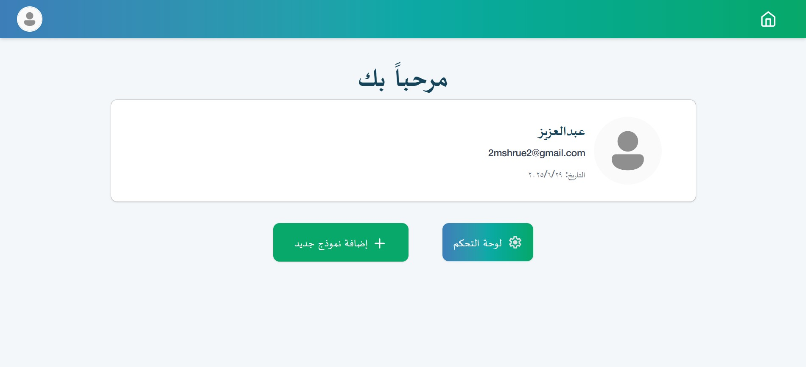
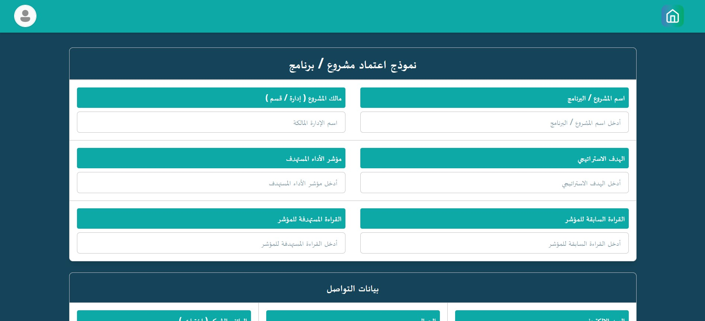
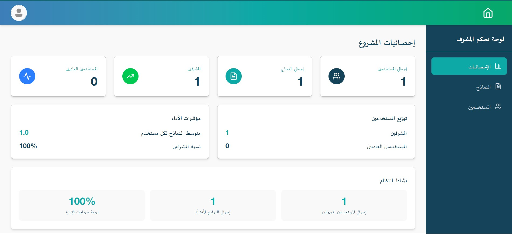
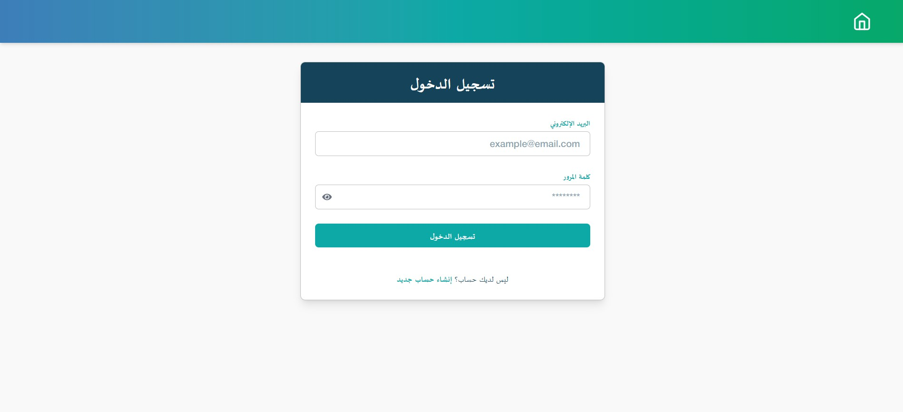

# 🎨 Manage Projects - Frontend (React.js)

This is the **Frontend** part of the **Manage Projects** system:  
A responsive, RTL-supported web interface built with **React**, **Tailwind CSS**,   
and **DaisyUI** for managing organizational projects and programs.

---

## 📌 Features

- ✅ Arabic RTL layout
- ✅ Mobile-first responsive design
- ✅ User Authentication (Login, Register)
- ✅ Form Creation & Editing
- ✅ Admin Dashboard Navigation
- ✅ PDF Export using **React-to-PDF**
- ✅ Context API for Auth and User State
- ✅ Toast Notifications using **React Toastify**

---

## 🛠️ Tech Stack

| Frontend | Tools |
|---|---|
| Framework | React.js |
| Styling | Tailwind CSS + DaisyUI |
| PDF Export | React-to-PDF |
| State | React Context API |
| Routing | React Router |
| Notifications | React Toastify |
| HTTP Client | Axios |

---

## 🖼️ Screenshots

| 📷 | |
|-|--|
| Home Page |  |
| Form Page |  |
| Admin Dashboard |  |
| Login Page |  |

