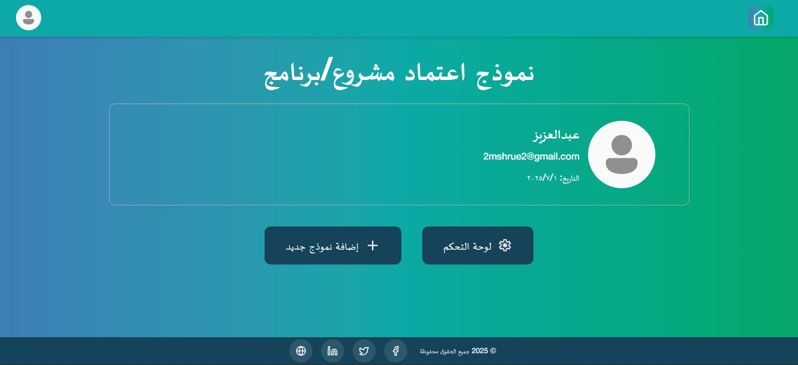
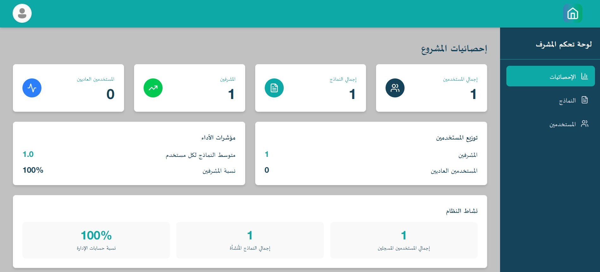

# 🎨 Manage Projects - Frontend (React.js)

This is the **Frontend** part of the **Manage Projects** system:  
A responsive, RTL-supported web interface built with **React**, **Tailwind CSS**,  
and **DaisyUI** for managing organizational projects and programs.

🔗 **Backend Repository:** [Backend on GitHub](https://github.com/abdallaskar/MshruBack)  
🚀 **Live Demo:** [Live App](https://mshru-qassim.vercel.app/)

---

## 📌 Features

- ✅ Arabic RTL layout
- ✅ Mobile-first responsive design
- ✅ User Authentication (Login, Register)
- ✅ Form Creation & Editing
- ✅ Admin Dashboard Navigation
- ✅ PDF Export using **React-to-PDF**
- ✅ Word Export using **docx**
- ✅ Context API for Auth and User State
- ✅ Toast Notifications using **React Toastify**

---

## 🛠️ Tech Stack

| Frontend     | Tools                    |
|--------------|--------------------------|
| Framework    | React.js                 |
| Styling      | Tailwind CSS + DaisyUI   |
| PDF Export   | React-to-PDF             |
| Word Export  | docx                     |
| State        | React Context API        |
| Routing      | React Router             |
| Notifications| React Toastify           |
| HTTP Client  | Axios                    |

---

## 🖼️ Screenshots

| 📷 Page         | Preview |
|----------------|---------|
| Home Page      |  |
| Form Page      |  |
| Admin Dashboard|  |
| Login Page     |  |
